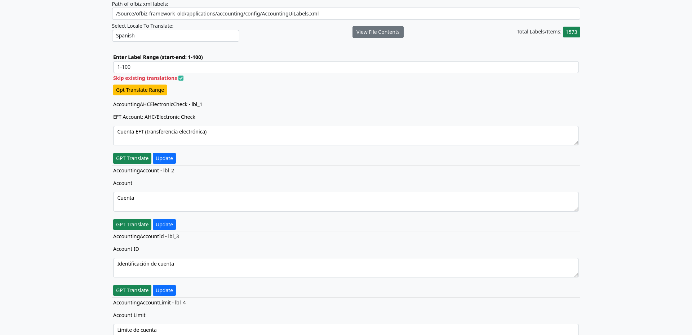

# README

### OpenAI api key.

* Create your openai account at [OpenAI platform](https://platform.openai.com)
* Then go to your profile [OpenAI profile link] (https://platform.openai.com/settings/profile)
* Select API keys from left side pane.
* click the generate new secret key.
* Copy your key and paste it in the application.properties file in (OpenAI.apiKey) property.

### Run the application.

* from the command line run the following command
    
      mvn clean spring-boot:run

* Or you can run it with your IDE.

* By default, the application url is [http://localhost:9878](http://localhost:9878)

### Application UI

### Usage

* Enter the full path of ofbiz UI Labels XML file you want to translate.
* Select the locale you need to translate to.
* Click view contents.
* A list of labels with English by default with  selected locale labels will be loaded from the xml file, notice the suffix for the label order lbl_xxxx.
* If no translation keys exists for the selected locale it will be added automatically.

* Now you can translate the labels with  the following options.
  * Your own transaltion by directly writing in the textarea, _then click_ __Update__.
  * By GPT api by press GPT Translate button, _then click_ __Update__.
  * Or you can translate ranges with GPT, but you have to put the range in the header of the page in the following format ( start - end ) like 1 - 100
  * Make sure to check/uncheck Skip existing translations as needed
  * __Notice the suffix for the label key, lbl_xxxx__ this is used for range translate.